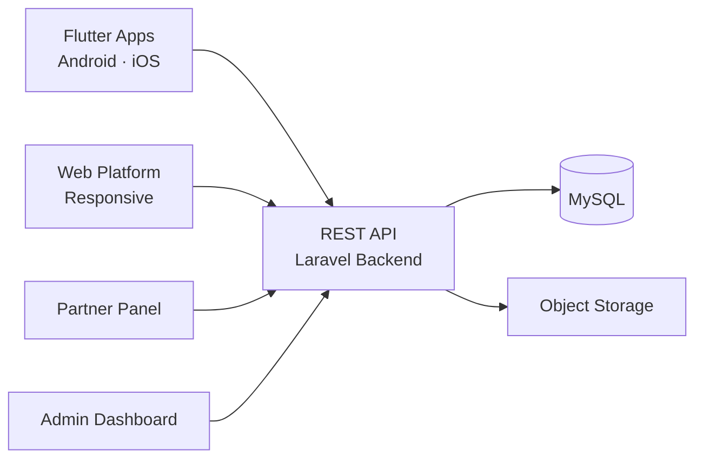

# Fancy Clone — White-Label Solution by Miracuves

---

## Table of Contents

1. [Who Is This For?](#who-is-this-for)
2. [How It Works](#how-it-works)
3. [Core Features](#core-features)
4. [Architecture](#architecture)
5. [Revenue Streams](#revenue-streams)
6. [What's Included](#whats-included)
7. [Deployment Timeline](#deployment-timeline)
8. [Why Not Build From Scratch?](#why-not-build-from-scratch)
9. [Market Opportunity](#market-opportunity)
10. [Client Testimonials](#client-testimonials)
11. [FAQ](#faq)
12. [Resources](#resources)
13. [About Miracuves](#about-miracuves)

## Live Demos

| Environment | URL | What you can test |
|---|---|---|
| Web Platform | [mxazon.mimeld.com](https://mxazon.mimeld.com) | Full experience in the browser |
| Mobile App (Android) | [mas.mimeld.com](https://mas.mimeld.com) | Browse, transact, engage |
| Admin Dashboard | [Solution page → Demo](https://miracuves.com/fancy-clone/#demo) | Users, content, plans, analytics |

Demo credentials: [miracuves.com/fancy-clone -> Demo section](https://miracuves.com/fancy-clone/#demo)

## What Makes This Fancy Clone Different

<!-- TODO: fill 3-5 vertical-specific differentiators -->

## Who Is This For?

| Buyer Type | Use Case |
|---|---|
| Startup Founders | Launch a curated social commerce platform |
| Brands | Create a direct-to-consumer discovery channel |
| Agencies | White-label social commerce for clients |

---

## How It Works

1. User discovers products through curated collections
2. User follows vendors and saves favorites
3. User purchases with secure checkout
4. Vendor ships the product
5. User shares their collection with followers

---

## Core Features

### User App
- Product discovery
- Social feed
- Wishlist
- Purchase

### Admin
- Product mgmt
- Orders
- Revenue

---

## Advanced Features

The platform integrates AI-powered features that reduce manual overhead and capture revenue opportunities:

- **AI Curation Engine** - Personalized product recommendations
- **AI Trend Detection** - Identifies trending products for curation
- **AI Discovery** - Curated product feeds

---

## Apps and Web Panels

| Module | Description |
|---|---|
| Customer App | Discover, shop, share |
| Vendor Dashboard | Store, products, orders |
| Admin Panel | Curation, vendors, analytics |

---

## Architecture

**Stack:**

| Layer | Technology |
|---|---|
| Mobile | Flutter |
| Backend | Node.js + Express |
| Database | MongoDB |
| Payments | Stripe, Razorpay |

---

## Revenue Streams

The platform is engineered to generate revenue from day one through multiple complementary channels:

- **Commission per sale** - 10-20%
- **Featured placements**
- **Vendor subscription**
- Commission
- Featured products
- Subscription

---

## Security and Compliance

- OTP-based authentication
- SSL/TLS encrypted API communication
- GDPR-ready data handling

---

## What's Included

| Plan | Price | What You Get |
|---|---|---|
| Standard | **$2,899** | Complete source code, all apps, admin panel, rebranding, 1 year updates |
| Enterprise | Custom Quote | Everything in Standard + custom features, multi-region, priority support |

**What is included:**

- Customer App
- Vendor Dashboard
- Admin Panel
- Full Source Code
- Complete Rebranding (your logo, colors, app name)
- Server Deployment
- App Store and Google Play Submission Support
- 60 Days Free Bug Support
- Free 1-Year Updates

---
**Pricing:** from **$2,899** — transparent on the [solution page](https://miracuves.com/fancy-clone/#pricing).

## Deployment Timeline

| Day | Milestone |
|---|---|
| Day 1 | Server setup, environment configuration, initial deployment |
| Day 2 | White-labeling - app name, logo, colors, splash screens |
| Day 3 | Payment gateway integration + third-party API configuration |
| Day 4 | Custom feature implementation (if applicable) |
| Day 5 | QA, testing, bug fixes across all panels |
| Day 6 | App Store + Google Play submission + Go-live |

> **Average go-live: 6 business days from payment confirmation.**

---

## Why Not Build From Scratch?

| Factor | Build from Scratch | Miracuves Solution |
|---|---|---|
| Time to Launch | 6-12 months | 6 days |
| Development Cost | $60,000-$150,000 | From $2,899 |
| Source Code Ownership | Yes | Yes |
| Customization | Full | Full |
| Post-Launch Support | Depends on team | 60 days included |
| Risk | High | Low |

---

## Market Opportunity

| Metric | Data |
|---|---|
| Social Commerce Market (2030) | $6.2 trillion |
| Key Markets | USA, India, China, SEA |

> Source: Statista, Grand View Research, Allied Market Research

---

## Successful Verticals

- Social commerce platforms
- Curated discovery shopping
- Brand collaboration platforms
- Social commerce
- Lifestyle
- Fashion
- Home decor
- Gifts

---

## Client Testimonials

> *"The platform exceeded our expectations. Launched in 6 days and everything works perfectly."*
> - Founder

> *"Exceptional results from day one."*
> - Verified Client

> *"Scaled 3x faster than expected."*
> - Startup Founder

---

## FAQ

**How much?**
Starts at $2,899.

**Source code?**
Yes, complete ownership.

**Launch time?**
6 business days.

**Do you offer support after launch?**
Yes. 60 days of free bug support included.

---

## Related Solutions

Explore our other white-label clone solutions:

- [Amazon Clone - Ecommerce](https://github.com/Miracuves-Solutions/Amazon-Clone)
- [Flipkart Clone - Marketplace](https://github.com/Miracuves-Solutions/Flipkart-Clone)

---

## Resources

- [Full Solution Page](https://miracuves.com/fancy-clone/) — features, pricing, demos, FAQ

## Get Started

**Ready to launch your social commerce platform?**

| Channel | Link |
|---|---|
| Full Solution Page | [miracuves.com/fancy-clone](https://miracuves.com/fancy-clone/) |
| Email | info@miracuves.com |
| WhatsApp | [+91 98300 09649](https://wa.me/919830009649) |
| Book a Call | [Free Consultation](https://miracuves.com/contact/) |

---

## About Miracuves

**Miracuves Solutions Pvt. Ltd.** is a Mumbai-based software company specializing in white-label clone app solutions across 12+ industries.

- 90+ ready-to-deploy solutions
- 6-day delivery guarantee
- 60+ engineers on staff
- 3,900+ apps delivered
- Full source code ownership
- Clients across 40+ countries including India and USA

[Explore all 90+ solutions at miracuves.com](https://miracuves.com)

---

## Disclaimer

This product is independently developed by Miracuves. All product names, logos, and brands are property of their respective owners. Use of these names does not imply endorsement.

---

*(c) 2026 Miracuves Solutions Pvt. Ltd. | Mumbai, India*
*This repository contains product documentation only - no proprietary source code is published here.*

*Keywords: fancy clone, fancy script, white label solution, laravel flutter app, clone script*

---

### Note on This Repository

This repository is a product overview. The full source code is delivered to clients on purchase. For a hands-on evaluation, use the live demos above; credentials are public on the solution page.

<!--
=========================================================
GENERATED FROM MIRACUVES NETFLIX-CLONE README TEMPLATE
Canon: 6 working days, from $2,799 floor, 60 days support + 12 months updates.
Never use 3 days. See https://miracuves.com/facts/ for audited claims.
=========================================================
-->
